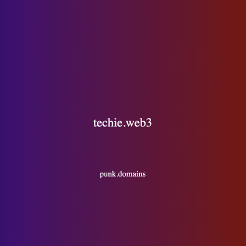

# Standard TLD factory contract

TLD Factory is owned by Punk Domains governance. This contract is responsible for issuing new TLDs and keeping a list of all TLDs created through it, and their respective addresses.

**Contract code:** https://github.com/punk-domains-2/punk-contracts/blob/main/contracts/factories/standard/PunkTLDFactory.sol

## Public state variables

Note that public state variables can also be used as read methods, that's why their code is listed as a method.

### `tldNamesAddresses`

Returns an array of all TLDs that were created with this factory contract.

```solidity
function tldNamesAddresses(string memory tldName) public view returns(address)
```

Input:

- The TLD name (must start with a dot)

Output:

- The TLD contract address

### `royalty`

For every new domain name (created in a TLD contract) a royalty payment is taken and sent to Punk Domains governance.

In case a domain is created for free by TLD owner, or if royalty is set to 0, there's no royalty to be paid.

The royalty amount set in the Factory contract applies only to newly created TLDs and can be then changed separately in each TLD contract.

```solidity
function royalty() public view returns(uint256)
```

Output:

- TLD royalty in wei

### `price`

Returns the price to create a new TLD.

```solidity
function price() public view returns(uint256)
```

Output:

- TLD price in wei

### `buyingEnabled`

If this value is set to `false`, only the Factory owner (Punk Domains governance) can create new TLDs (for free). Otherwise anyone can create new TLDs (but paid).

```solidity
function buyingEnabled() public view returns(bool)
```

Output:

- Boolean value (`true` or `false`)

### `nameMaxLength`

Returns the maximum length of a TLD name.

```solidity
function nameMaxLength() public view returns(uint256)
```

Output:

- The number of characters that a TLD name can have at maximum

### `projectName`*

This is useful for default domain name NFT images which show the project name at the bottom:



```solidity
function projectName() public view returns(string)
```

Output:

- A string stored in the `projectName` state variable

## Read methods

### `getTldsArray`

Returns an array of all TLDs that were created with this factory contract.

```solidity
function getTldsArray() public view returns(string[] memory)
```

Output:

- An array of TLD names

## Write method

### `createTld`

If buying TLDs is enabled, anyone can create a new TLD name.

```solidity
function createTld(
	string memory _name,
	string memory _symbol,
	address _tldOwner,
	uint256 _domainPrice,
	bool _buyingEnabled
) public payable returns(address)
```

Inputs:

- `_name`: A TLD name, for example `.wagmi`. Then name must contain only one dot which must be at the beginning.
- `_symbol`: The symbol is usually TLD name in uppercase letters. Symbol is only needed because the ERC-721 standard requires it, otherwise it's irrelevant.
- `_tldOwner`: The owner of the newly created TLD. Can be a different entity than the `msg.sender`. TLD owner will receive payments for all newly created domains under this TLD.
- `_domainPrice`: Price for creating new domains under this TLD. TLD owner can change this at any time in the TLD contract.
- `_buyingEnabled`: Should buying domains be enabled from the start or not.

Output:

- Newly created TLD address

## Owner methods

### `ownerCreateTld`

Factory owner can create a new TLD for free.

```solidity
function ownerCreateTld(
	string memory _name,
	string memory _symbol,
	address _tldOwner,
	uint256 _domainPrice,
	bool _buyingEnabled
) public onlyOwner returns(address)
```

Inputs:

- `_name`: A TLD name, for example `.wagmi`. Then name must contain only one dot which must be at the beginning.
- `_symbol`: The symbol is usually TLD name in uppercase letters. Symbol is only needed because the ERC-721 standard requires it, otherwise it's irrelevant.
- `_tldOwner`: The owner of the newly created TLD. Can be a different entity than the `msg.sender`. TLD owner will receive payments for all newly created domains under this TLD.
- `_domainPrice`: Price for creating new domains under this TLD. TLD owner can change this at any time in the TLD contract.
- `_buyingEnabled`: Should buying domains be enabled from the start or not.

Output:

- Newly created TLD address

### `changeRoyalty`

Factory owner can change the initial royalty amount which is set when a new TLD is created. The royalty amount can then be changed separately in each TLD contract by the Factory owner.

```solidity
function changeRoyalty(uint256 _royalty) public onlyOwner
```

Input:

- `_royalty`: royalty amount in wei

### `changePrice`

Factory owner can change the price for minting new TLDs.

```solidity
function changePrice(uint256 _price) public onlyOwner
```

Input:

- `_price`: TLD price in wei

### `changeProjectName`

Factory owner can change the project name (this shows in every domain default NFT image).

```solidity
function changeProjectName(string memory _newProjectName) public onlyOwner
```

Input:

- `_newProjectName`: New project name

### `changeNameMaxLength`

Factory owner can change the max name length for new TLDs.

```solidity
function changeNameMaxLength(uint256 _maxLength) public onlyOwner
```

Input:

- `_maxLength`: Max TLD name length

### `changeForbiddenTldsAddress`

When a new TLD is created, a TLD Factory needs to check with the Forbidden TLDs contract whether the TLD name is still available. If it is, the factory also needs to register the newly created TLD name with the Forbidden TLDs contract.

In order to do that, the Forbidden TLDs address needs to be specified in the factory contract.

```solidity
function changeForbiddenTldsAddress(address _forbiddenTlds) public onlyOwner
```

Input:

- `_forbiddenTlds`: The address of the Forbidden TLDs contract

### `toggleBuyingTlds`

Factory owner can either start or stop buying TLDs.

```solidity
function toggleBuyingTlds() public onlyOwner
```

----

*Methods marked with a star are specific for this contract. They are not obligatory for other contracts of that type.
