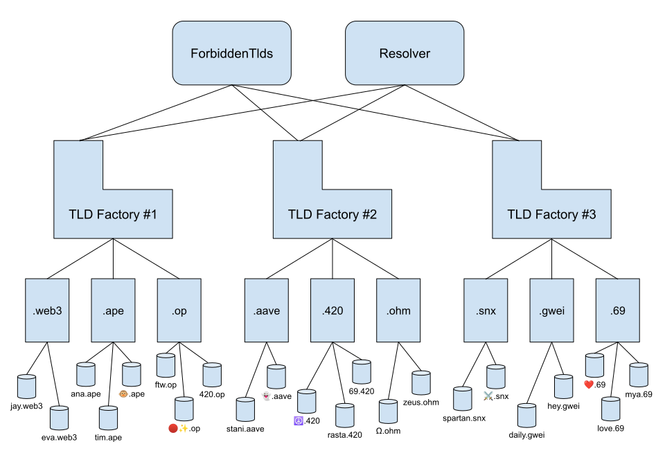

# Modular Architecture

Punk Domains protocol was built with modularity in mind, which makes it **very flexible** and allows for different parts of the module to be owned by different owners (for example, TLDs or even factories can be owned by a different owners).

Let's take a look at the graphical representation of the protocol and then dive into different parts.

## TLD factories

We'll start with the main component of the Punk Domains architecture: a TLD factory.

A TLD factory is a smart contract through which you can create new top-level domains (or TLDs, such as .web3, .ape, op, .etc). Each TLD is a separate smart contract, which is only possible because factory contracts have this "magical" ability to **create new contracts on-chain**. 

TLD contracts do **not** need to be created and deployed manually by any person. A new TLD contract is created dynamically on-chain, when the appropriate method in the factory contract is called (`createTld` method or `ownerCreateTld` method).

#### Why are there multiple factories?

Each factory holds a **template for a TLD** that can be created through it. These TLD templates must follow the same basic structure (the same set of base methods), but can implement some methods differently or even have some special additional methods.

For example, one TLD template can limit TLDs to the same metadata image background, while another template (from a different factory) can allow for custom domain images. Factories and templates could also differ on which business model they allow (renewable vs. one-time purchase) and in many other ways.

#### How many different types of TLD factories there are?

Currently we have two factories (Standard and Flexi), but we expect many more in the future. There's **no limit** on how many factories can be used in the Punk Domains protocol.

Even though existing factories right now are owned by the Punk Domains governance, they can be owned by different entities in the future. The protocol allows that and it works perfectly fine.

## The Forbidden TLDs contract

Because there are multiple factories that can produce new top-level domains, it's important that they **avoid collisions**.

In order to coordinate, there's a contract called `PunkForbiddenTlds` which holds a **list of already created** top-level domains. Factories, of course, are not allowed to create new TLDs with the same name (hence, the "forbidden TLDs list").

The Forbidden TLDs list does not include only TLDs from the Punk Domains ecosystem, but **also TLDs created by other protocols** such as `.eth` by ENS, and TLDs owned by Unstoppable Domains.

## The Resolver contract

Resolving a domain means querying an address (and other data) associated with this domain. There's also a reverse process (called reverse-resolver) where you try to find domain(s) associated with an address.

Each TLD contract has a resolver and a reverse-resolver implemented by default, as methods in the TLD contract itself.

But because there are so many TLD contracts, it's also good to have **a single smart contract** that can **resolve all TLDs** on the given chain. This contract is called `PunkResolver`, and is not crucial for the system to work, but it is a nice shortcut. 

Instead of having to find and/or store all TLD contract addresses, you just need to know one contract address (the resolver's address) and always resolve domains through that contract.
